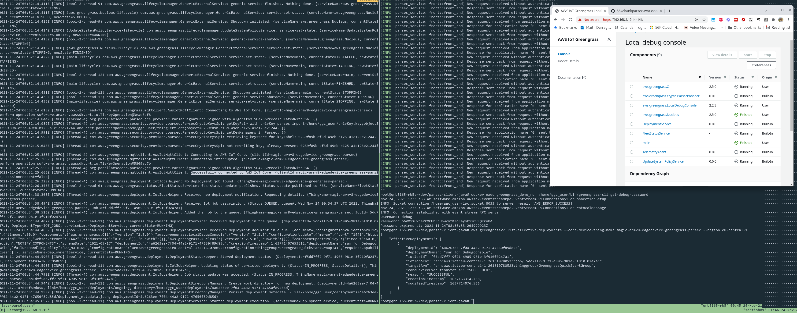

# AWS Greengrass using Parsec - Workshop

This is a short workshop on how to use PARSEC plugin in AWS Greengrass v2 Nucleaus to achieve native security across device hardware
Before you begin you should be family of both PARSEC and AWS Greengrass, have at least deployed both and understand the use case of both technologies, we recommend the following to become familur

* [AWS Greengrass V2 Workshop](https://catalog.us-east-1.prod.workshops.aws/v2/workshops/5ecc2416-f956-4273-b729-d0d30556013f/en-US/) 
* Parsec Walkthorugh with 

## DEMO
Located in this workshop is a "out of the box" demo setup which build and deploys the complete solution from the workshop learning steps, it is used as both a learning guide and short example when demonstrating the use of Parsec with AWS Greengrass

### How to get started

To get started you will need the following, an aarch64 or x86 device or your local computer, an active AWS account and your API credentials, Github access configurated locally
The demo.sh file will do the following

- Prepare Git and gitsubmodule (for sourcing the Java client, Greengrass Parsec plugin and build them )
- Build the docker containers that package in, AWS Greengrass, Parsec service and intermidate steps 

If you don't have hardware at hand, but still would like to test on an embedded device, then the ARM Hardware lab hosted by MiniNodes can help more info can be found here: https://github.com/WorksOnArm/mininodes-arm-edge

Tested on the following

- Apple M1 laptop (OSX Monterey 12.1)
- Intel based x86 workstation (test on Ubuntu, Fedora and ArchLinux)
- [Solid-Run MACCHIATOBin ARMADA 8040 (Cortex-A72)](https://developer.solid-run.com/article-categories/macchiatobin-single-double-shot/)
- [Solid-Run Honeycomb LXK2 NXP  (Cortex-A72)](https://www.solid-run.com/arm-servers-networking-platforms/honeycomb-workstation/)
- [Thundercomm RB5 5G development kit /w Qualcomm QRB5165 Snapdragon QRB5165 (Cortex-A)](https://www.thundercomm.com/app_en/product/1590131656070623)

TPM's currently being implemented as part of this workshop

- 96boards Secure96 TPM 
- Qualcomm SPU240 HW RoT / SPU (WIP)
- EDK II UEFI SoftTPM (new concept) 

### Example of 

Example of 3 screens, PArsec Service, Greengrass Local Debug Console showing 

## Contributions

Companies and Individusl that have contributed and participated in building this workshop
* [56K.Cloud](https://blog.56k.cloud/arm-parsec-and-56k-5gusecases/)
* [SayDo](https://www.saydo.co/en/)
* [ReVault](https://revault.ch/en/#)
* [Solid-Run](https://solid-run.com/)
* [ARM](https://developer.arm.com/solutions/infrastructure/developer-resources/security/parsec)